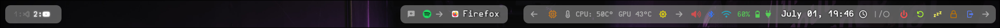

  
  <strong>My Hyprland / Arch Linux Dots</strong>
  

  <strong>Hello there!</strong> 
  

---

## 🌀 About This Repo

Here are my config files from my <strong> Hyprland</strong> ***rice*** 🍚 on <strong>󰣇 Arch Linux</strong> (**obviously!** ¯\\\_(ツ)_/¯).

This setup includes:

- 🖥️ Media scripts (notifications, play/pause/next)
- 📴 Power scripts (shutdown, restart, logoff, sleep — for Waybar)
- 🗃️ The dot files

> **Note:** I'm no scripting master, so bear with me... there’s <big>***a lot***</big> of room for improvement 🫡.

This is my first attempt at customizing Hyprland and Arch Linux on my own, and honestly...  

  

---

## 📚 How It Was Made

Most configurations are based on:

- 📖 Documentation ([Hyprland](https://wiki.hypr.land/), [kitty](https://sw.kovidgoyal.net/kitty/conf/), [mako](https://github.com/emersion/mako/wiki), [walker](https://github.com/abenz1267/walker/wiki), [Waybar](https://github.com/Alexays/Waybar/wiki), [Waypaper](https://anufrievroman.gitbook.io/waypaper))
- 🧠 [Hyprland Wiki — Example Configs](https://wiki.hypr.land/Configuring/Example-configurations/), [Starship themes](https://github.com/starship/starship)

I’ve added comments and links inside the config files to help others (especially beginners) get started in the **rice-ing world** (👀 did you catch that pun? 😎).

---

## ⚠️ Disclaimer

If you find any configuration, image, script, or other content in this repository that you believe belongs to you or was used without proper credit, please **reach out to me**.

I'll be more than happy to **give proper attribution** or **remove the content** if necessary. I built this rice mostly for personal use and learning, but I absolutely respect the work of others 🙏.

---

## 🌟 Support

If you like this rice:

  <big>    </big>

Leave a 🌟 on the repo!

If not, feel free to leave a comment...

  

---

## 🖼️ Wallpapers

If you liked any of the wallpapers shown in my screenshots or configs, feel free to **ask me** — I'd be happy to share them if possible!

(Some may not be mine originally, so I’ll share sources or credits when available.)

---

## 🎬 Demo

Want to see it in action? Check these out:

- 🔁 Preview GIFs:
  

    
    
    
  

- 📺 [Watch the full video on YouTube](https://your-link-here.com)
- 🖼️ Screenshots (from waybar)

    
    

---
